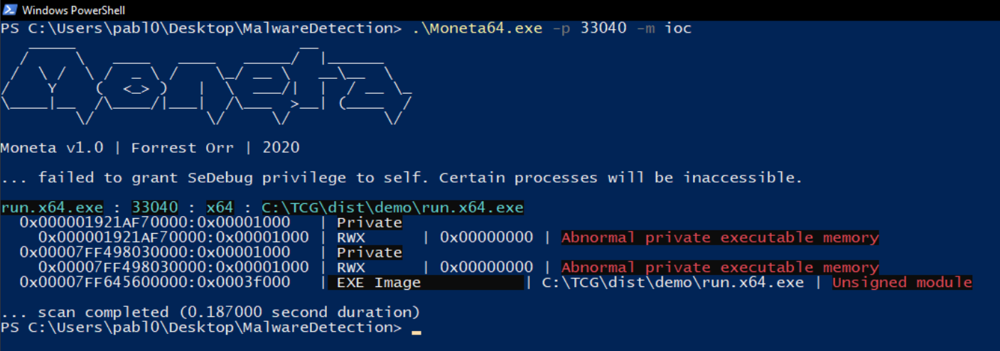
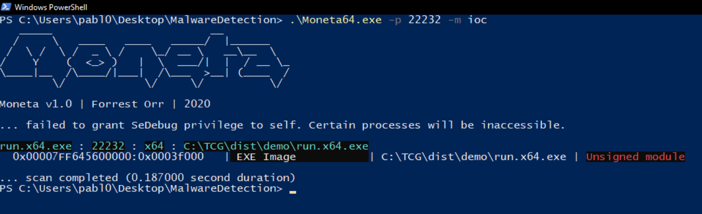

# Self-Cleaning PICO Loader for Crystal Palace

This loader demonstrates advanced in-memory self-cleaning techniques for offensive tooling. It dynamically determines its own start and end addresses in memory, enabling complete removal of the loader after execution.

## Dynamic Loader Boundaries
To obtain the base and end addresses of the injected PICO loader in memory:
- The loader is built with a small, empty file appended at the end (see `pic_end.o` in the loader spec).
- The entry point function executes `retptr`, a small assembly routine, at startup to capture and calculate the base address.
- The end address is determined by referencing the appended empty section.

## Memory Erasure Using Sleep Obfuscation Technique
With both addresses, the loader can:
- Erase and free its own memory region after payload execution.
- The sleep obfuscation technique (e.g., Ekko) is adapted here to enable complete removal of the PICO loader from process memory. Instead of obfuscating and sleeping, the technique is modified to zero and release the loader memory entirely.

## Key Steps
1. **Dynamic Address Discovery:**
   - `retptr` assembly routine returns the loader's base address.
   - The end address is found via the appended empty section.
2. **Self-Cleaning:**
   - The loader sets its memory to RW, zeroes it, and frees it using timer-based ROP gadgets.
   - No traces remain in the process memory after execution.

## Moneta Analysis: Loader Comparison

Below are two screenshots from Moneta showing the memory regions after payload execution:

### Default PICO Loader

*After execution, RWX regions containing the payload remain in the process memory.*

### Self-Cleaning PICO Loader

*After execution, RWX regions with the payload disappear, leaving no traces, and the process continues running normally.*

This demonstrates the effectiveness of the self-cleaning technique: the loader fully erases and frees its own memory, unlike the default loader which leaves potentially detectable regions in memory.

---
## References
- Sleep obfuscation based in [Ekko technique](https://github.com/Crystallize-Ekko/Ekko)
- [Crystal Palace](https://tradecraftgarden.org/crystalpalace.html)

## Warning: Control Flow Guard (CFG)

When injecting into processes with Control Flow Guard (CFG) enabled, a bypass is required for successful execution of self-cleaning or sleep-obfuscation techniques. For details and implementation, see: https://github.com/Crypt0s/Ekko_CFG_Bypass/tree/main